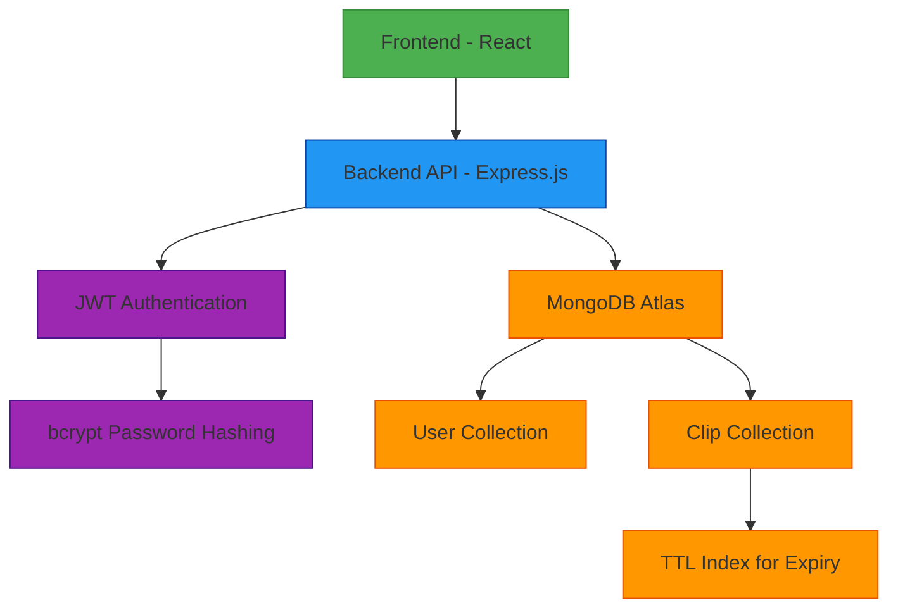

# Cloud Clipboard Architecture

## Component Descriptions

### Frontend (React)
- User interface for authentication (login/signup)
- Form for creating new clips
- View for displaying clip content
- Interface for viewing access logs

### Backend API (Express.js)
- RESTful API endpoints for authentication and clip management
- JWT-based authentication middleware
- Business logic for clip creation and retrieval
- Integration with MongoDB for data persistence

### Database (MongoDB Atlas)
- **User Collection**: Stores user information (email, hashed password)
- **Clip Collection**: Stores clip data (content, type, share code, expiry)
- **TTL Index**: Automatically deletes expired clips

### Security Features
- **JWT Authentication**: Secure token-based authentication
- **bcrypt**: Password hashing for secure storage
- **CORS**: Cross-origin resource sharing protection